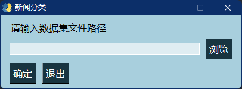

# FastText New GUI

## Get Started

### For Users

* Download the binary file from [here](https://github.com/LiRunyi2001/cnSoftBei/releases/download/v2/FastTextNewGUI.zip).
* Extract it and double click `main.exe`

### For Developers

* Download the [FastText wheel](https://www.lfd.uci.edu/~gohlke/pythonlibs/#fasttext) depending on your Python version.
* Download the pretrained model from [here](https://1drv.ms/u/s!AmRrl2CAWm_2hNhj7Mu-V2Ku15dQKg?e=zxg1cA).
* Run scripts:

  ```shell
    pip install fasttext-<version>-<python-version>-<architecture>.whl
    pip install PySimpleGUI
    pip install pyinstaller
    pip install pandas
    pip install
  ```

* Enjoy coding.

## ScreenShot


